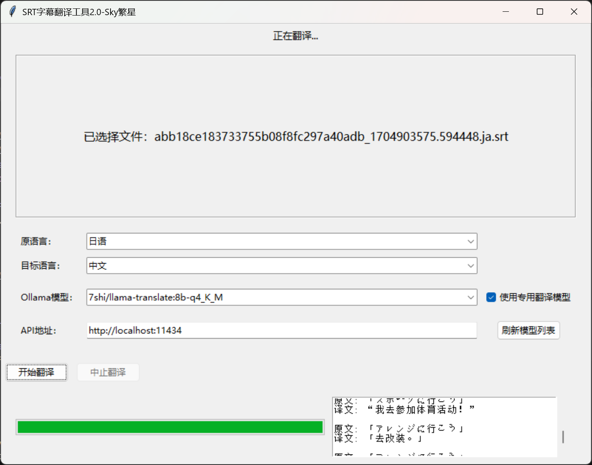
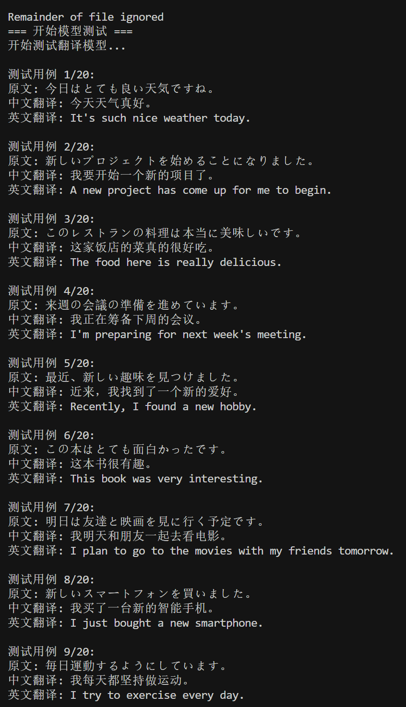
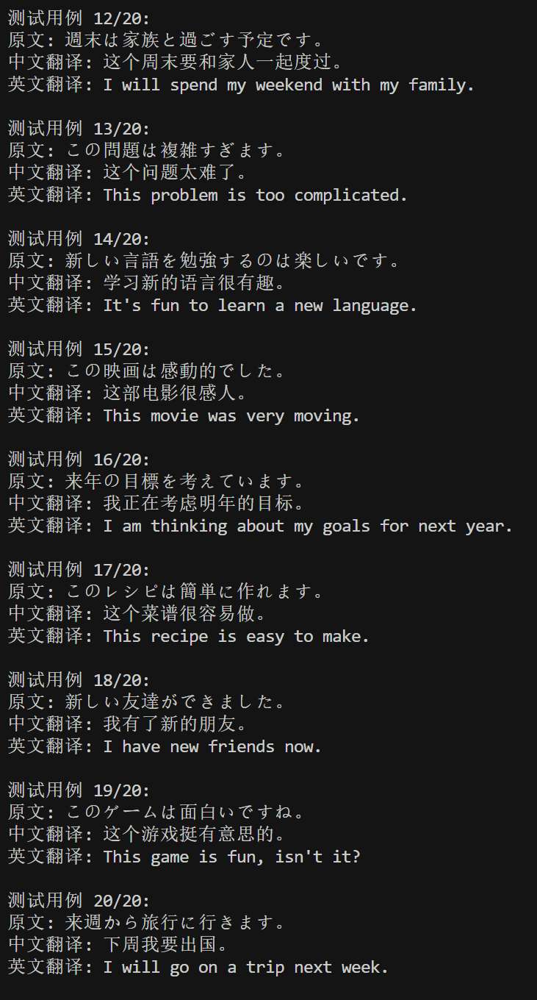

# SRT字幕翻译工具2.0

一个基于Ollama本地大模型的SRT字幕文件翻译工具，支持多种语言之间的翻译，提供友好的图形界面和实时翻译预览功能。

## 版本选择建议

- 1.0版本：适合所有用户，无需安装额外软件，开箱即用（157MB）[点击此处下载最新版exe安装包](https://download.csdn.net/download/weixin_45826970/90912987)
- 2.0版本：需要安装Ollama，适合有经验的用户，支持更多语言和更好的翻译效果（17MB）[点击下载本地AI版](https://github.com/314baidashi/srt-Trans2.0/raw/refs/heads/main/SRT%E5%AD%97%E5%B9%95%E7%BF%BB%E8%AF%91%E5%B7%A5%E5%85%B72.0%EF%BC%88ollama_AI%E7%89%88%EF%BC%89.exe)

## 功能特点

- 🚀 基于Ollama本地大模型，支持多种模型选择
- 🌐 支持多种语言翻译（英语、日语、中文之间的相互翻译）
- 📝 实时翻译预览，显示原文和译文对照
- 🎯 支持拖放操作，简单易用
- ⏱️ 实时显示翻译进度
- 🛑 支持随时中止翻译过程
- 🔄 动态检测和加载Ollama模型
- 💾 自动保存翻译结果，保持原时间轴

## 系统要求

- Windows 10/11
- Ollama（需要预先安装并运行）
- 显卡要求：
  - 推荐使用 NVIDIA 显卡以获得更好的性能
  - 作者发现翻译速度与1.0版本的小模型相当（当然可能是因为我的是NVIDIA RTX 4080 显卡）

## 安装步骤

1. 安装Ollama
   - 访问 [Ollama官网](https://ollama.ai) 下载并安装
   - 运行Ollama服务
   - 下载需要的模型：
     - 用户可以选择使用推荐翻译模型，并在勾选后自动下载[llama-translate](https://ollama.com/7shi/llama-translate)，这是专门为翻译任务优化的模型
     - 也可以使用其他本地通用模型（如 llama2、qwen 或 gemma）
   - 注意：不要下载思考模型（thinking models），这些模型不适合翻译任务

2. 运行程序
   - 双击运行 SRT字幕翻译工具2.0.exe
   - 首次运行可能需要允许防火墙访问

## 使用说明

1. 启动程序
   - 确保Ollama服务正在运行
   - 运行程序后会自动检测Ollama服务状态
   - 自动加载可用的模型列表

2. 选择翻译设置
   - 选择源语言（英语/日语/中文）
   - 选择目标语言（根据源语言自动显示可选的目标语言）
   - 选择要使用的Ollama模型
   - 确认Ollama API地址（默认为 http://localhost:11434）

3. 开始翻译
   - 将SRT文件拖放到程序窗口
   - 点击"开始翻译"按钮
   - 实时查看翻译进度和结果
   - 如需中止翻译，点击"中止翻译"按钮

4. 查看结果
   - 翻译完成后会自动保存
   - 输出文件将保存在原文件同目录下
   - 文件名会自动添加目标语言代码后缀

## 注意事项

- 确保Ollama服务正常运行
- 建议使用较大的模型以获得更好的翻译效果
- 翻译大文件时可能需要较长时间
- 可以随时中止翻译过程
- 翻译过程中请勿关闭Ollama服务
- 不要使用思考模型（thinking models）进行翻译

## 常见问题

1. 程序无法启动
   - 检查是否已安装Ollama
   - 确认Ollama服务是否正在运行
   - 检查防火墙设置

2. 无法检测到模型
   - 确认Ollama服务是否正常运行
   - 检查API地址是否正确
   - 尝试点击"刷新模型列表"按钮
   - 确保已下载了合适的翻译模型

3. 翻译质量不理想
   - 尝试使用更大的模型
   - 检查源文件格式是否正确
   - 确保使用的是翻译模型而不是思考模型

## 更新日志

### 2.0版本
- 添加Ollama本地大模型支持
- 新增实时翻译预览功能
- 添加翻译中止功能
- 优化界面布局
- 改进错误处理机制
- 支持英语、日语、中文之间的相互翻译

## 作者

Sky繁星 
